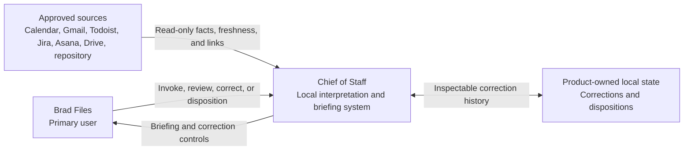
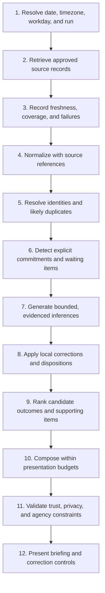

# Architecture Overview

- **Status:** Accepted
- **Version:** 2
- **Owner:** Brad
- **Last updated:** 2026-07-25

This document defines the technical architecture required for
[Daily Briefing v1](../product/features/daily-briefing-v1.md). It establishes
system boundaries, information flow, security constraints, and decisions that
must precede implementation. It establishes the initial execution, runtime,
deployment, persistence, data-lifecycle, and interaction direction while
deferring scheduler and specific web framework choices.

The architecture is subordinate to the accepted
[Product Vision](../product/vision.md) and
[Constitution](../foundations/constitution.md). It uses the
[Leadership Model](../foundations/leadership-model.md) as descriptive context
and the [Product Requirements](../product/requirements.md) and feature
specification as the product contract.

Acceptance establishes the Version 1 architectural boundaries. Reversible
implementation details may evolve within those boundaries. Material changes
to system boundaries, security, privacy, data lifecycle, provider behavior, or
other consequential architectural choices require review and an architecture
decision record.

## Scope

### In scope

- Read-only access to approved Phase 1 sources
- Source-specific connector boundaries
- Minimal source retrieval and normalized internal records
- Provenance and authoritative source links
- Cross-source identity resolution, association, and deduplication
- Commitment and waiting-item extraction and inference
- Priority ranking and briefing generation
- Bounded local correction and disposition state
- Workday determination and invocation boundaries
- Privacy, security, retention, deletion, and auditability
- Synthetic, redacted, or access-controlled evaluation
- Local deployment and operational reliability

### Out of scope

- Dashboard or analytics product
- Rock RMS
- Church Online Platform
- Ministry analytics
- Autonomous external actions
- Sending email
- Modifying tasks, calendars, documents, Jira, or Asana
- Multi-user product generalization
- Mobile applications
- Premature scaling or distributed-system architecture

## Architectural Principles

1. Use the accepted local-first execution model and favor simplicity unless a
   clear requirement demands otherwise.
2. Keep external systems authoritative for their records.
3. Retrieve and persist no more source content than necessary.
4. Preserve provenance for factual claims, inferences, and recommendations.
5. Separate source facts, normalized records, inferences, recommendations, and
   local corrections.
6. Keep persistent local conclusions inspectable, correctable, and deletable.
7. Prefer deterministic processing where practical; use language-model
   judgment only where it adds clear value.
8. Make inference evidence and reasoning explainable.
9. Degrade gracefully and disclose partial coverage when a connector fails.
10. Never commit credentials, private source content, production data, or
    sensitive evaluation material to Git.

## 1. System Context

Brad Files is the single primary user. Chief of Staff is a local interpretation
and briefing system between Brad and approved source systems; it does not
replace those systems or become authoritative for their records.

The system has two distinct data relationships:

- **External authoritative records:** Read-only facts retrieved from Google
  Calendar, Gmail, Todoist, Jira, Asana, approved Google Drive content, and
  approved repository context.
- **Product-owned local state:** Inspectable corrections and dispositions that
  affect briefing interpretation without changing an external record.

The external-source boundary requires connector-specific authorization and
read-only behavior. The local-data boundary may contain sensitive derived
information and requires explicit retention, deletion, backup, and access
controls. The Git repository contains design and synthetic fixtures only,
never either category of private runtime data.

## 2. Architectural Boundaries

The architecture uses replaceable logical components. Version 1 deploys these
components in one local Python process; separation of responsibility does not
imply separate services.

| Component | Responsibility | Boundary |
| --- | --- | --- |
| Invocation and workday context | Resolve briefing date, timezone, workday status, invocation mode, and run identity | Does not select priorities or read source content |
| Connector layer | Authorize through the approved credential boundary and retrieve source-specific records | OAuth and Keychain by default for cloud sources; read-only and does not infer meaning or mutate a source |
| Retrieval and snapshot layer | Coordinate connector runs, capture freshness and coverage, and retain only necessary retrieval material | Does not redefine source facts |
| Normalization layer | Convert source-specific records into a common conceptual model while preserving raw references | Does not merge conflicts or create recommendations |
| Identity and deduplication layer | Associate likely actors, records, and cross-source representations conservatively | Does not discard source records or hide ambiguity |
| Inference layer | Detect explicit items and propose bounded inferred commitments, waiting items, and preparation needs | Uses an application-owned provider-neutral boundary; no source, tool, database, or mutation access |
| Local correction-state store | Record inspectable corrections and dispositions and project their current state | Does not rewrite external records |
| Priority and recommendation engine | Rank candidate outcomes and supporting items using product and leadership context | Does not compose unsupported facts |
| Briefing composer | Produce the canonical briefing from selected structured content | Must obey presentation and agency budgets |
| Policy and output validator | Check provenance, privacy, duplication, confidence disclosures, length, and external-write boundaries | May reject or downgrade output |
| Evaluation harness | Run deterministic, connector, inference, regression, and end-to-end scenarios | Uses synthetic, redacted, or access-controlled data |
| User interface boundary | Present briefing output and correction controls | Uses a lightweight local web interface; specific framework and interaction design remain open |

Each boundary should expose structured inputs and outputs so deterministic
logic, language-model judgment, persistence, and presentation can be tested
independently.

## 3. Data Flow

A briefing run follows this sequence:

1. Determine the briefing date, timezone, workday context, and run identity.
2. Retrieve approved records from each enabled source.
3. Record connector coverage, retrieval time, source freshness, and failures.
4. Normalize records while preserving source meaning and stable references.
5. Resolve likely identities, relationships, and duplicates conservatively.
6. Detect explicit commitments, requests, waiting items, deadlines, and
   preparation signals.
7. Generate bounded inferences with source evidence, explanations, and
   confidence.
8. Apply Brad's prior corrections and dispositions to materially unchanged
   evidence.
9. Rank candidate outcomes and supporting items.
10. Compose the briefing within canonical ordering and presentation budgets.
11. Validate provenance, privacy, duplication, confidence, and agency
    boundaries.
12. Present the briefing and controls for correction or disposition.

A failed connector does not fail the entire run unless its absence makes the
briefing misleading or unsafe. Partial runs must identify missing coverage and
lower or withhold affected recommendations.

## 4. Connector Model

Every connector implements a common, read-only conceptual contract:

| Contract field | Purpose |
| --- | --- |
| Source name | Stable connector identity |
| Approved account or scope | Accounts, projects, folders, repositories, labels, or other boundaries Brad has authorized |
| Retrieval window | Time or query range requested for the run |
| Retrieved at | Time the connector completed retrieval |
| Source freshness | Best available indication of when the source record was current |
| Stable source identifier | Source-owned identifier used for provenance and reconciliation |
| Display link | User-facing link to the authoritative record when available |
| Raw-source reference | Minimal reference or temporary retrieval handle; not necessarily a persisted content copy |
| Normalized record output | Source facts converted to the common conceptual model |
| Coverage report | What the connector searched, omitted, or could not access |
| Error report | Structured full-failure and partial-failure information |

Connectors must not rank priorities, infer commitments, or write to a source.
They should return enough source context for downstream interpretation while
minimizing copied content.

Cloud connectors use provider-supported OAuth authorization-code flows by
default and store secret values in macOS Keychain. Approved local repository
context needs no remote credential when read from an approved local path.
Exact accounts, resource boundaries, scopes, provider registration, refresh
behavior, and revocation procedures belong in each connector specification.
Read-only behavior is enforced through scopes, connector interfaces, and
contract tests.

Phase 1 requires connectors for:

- Google Calendar
- Gmail
- Todoist
- Jira
- Asana
- Approved Google Drive content
- Approved repository context

Connector-specific retrieval rules, permissions, freshness semantics, bounded
cache exceptions, and failure behavior belong in the
[planned connector specifications](connectors/README.md#planned-specifications).
This overview defines only their common boundary.

## 5. Internal Information Model

SQLite is the accepted persistence layer, but this information model remains
conceptual and does not prescribe final database tables or serialization
formats. The persistence and data-lifecycle boundaries are recorded in
[ADR-0004](../decisions/0004-adopt-sqlite-and-bounded-local-data-lifecycle.md).

Every stored or transient item should distinguish:

- Authoritative source facts
- Normalized attributes
- Inferred attributes
- Confidence and inference method
- Source evidence and display links
- User corrections or dispositions
- Processing and policy version

| Entity | Purpose and classification |
| --- | --- |
| `SourceRecord` | Minimal envelope for authoritative source identity, facts, freshness, display link, retrieval reference, and connector run |
| `Actor` | Normalized person or organization identity with source-specific aliases; uncertain identities remain separate |
| `CalendarEvent` | Calendar-owned time, participants, location, links, and status plus normalized transition or preparation context |
| `Task` | Source-owned task facts such as title, status, due date, assignee, project, and source system |
| `Message` or `Conversation` | Message facts and thread relationships needed for waiting or commitment analysis; raw content is minimized |
| `Commitment` | Explicit or inferred promise or obligation with actor, expected result, timing, evidence, confidence, explanation, and local disposition |
| `WaitingItem` | Explicit or inferred expectation that a person is waiting on Brad, with relationship context, evidence, confidence, and explanation |
| `PreparationItem` | Work inferred or stated as necessary before an event, deadline, or decision |
| `CandidateOutcome` | Ranked meaningful result proposed for Today's Outcomes, with factors, evidence, and governing context |
| `Recommendation` | Advisory action or interpretation with rationale, confidence, evidence, and target briefing section |
| `SourceEvidence` | Stable source reference, relevant excerpt or fact pointer, freshness, and display link supporting an inference or recommendation |
| `LocalDisposition` | Timestamped confirmation, correction, dismissal, delegation, rescheduling, completion, abandonment, or deletion event |
| `Briefing` | Structured section content, rendered output, coverage statement, validation result, and run metadata |
| `ConnectorRun` | Per-source retrieval request, coverage, freshness, timing, warnings, and errors |

Inferences never overwrite authoritative facts. A corrected normalized value or
inference is represented as a local overlay with provenance, not as a silent
mutation of the source record.

## 6. Local State and Correction Model

Local state supports these user dispositions:

- Confirmed
- Corrected
- Dismissed
- Delegated
- Rescheduled
- Completed
- Intentionally abandoned
- Deleted

Each disposition links to stable source evidence and records:

- The affected inferred or normalized item
- The evidence identity and evidence fingerprint
- The prior value or state
- Brad's correction or disposition
- Timestamp and originating briefing
- Optional explanation
- Processing or policy version

SQLite stores an append-oriented disposition history and a derived
current-state projection. This pattern makes changes inspectable and supports
regression testing without destructively replacing history.

The history is append-oriented rather than absolutely immutable. A privacy or
deletion request must be able to remove sensitive payloads and dependent
indexes. A minimal non-sensitive tombstone or fingerprint may remain only when
necessary to prevent recurrence and permitted by the accepted deletion policy.

To prevent recurrence:

1. Derive an evidence fingerprint from stable source identifiers and the
   material facts that supported the inference.
2. Apply a prior correction or disposition when materially unchanged evidence
   produces the same candidate.
3. Reconsider the candidate only when relevant evidence materially changes.
4. Explain why a changed candidate reappears despite prior local state.

Local state affects briefing interpretation only. When it conflicts with a
later authoritative source state, the system preserves both, surfaces material
conflicts, and asks for correction when deterministic reconciliation is not
safe.

Brad must be able to inspect, correct, and delete persistent local conclusions.
Corrected examples may update explicit local suppression or interpretation
rules and regression scenarios; they must not create an opaque personal
profile.

## 7. Inference and Ranking Pipeline

All probabilistic inference uses an application-owned, provider-neutral
boundary with the OpenAI API as the initial hosted provider, as recorded in
[ADR-0006](../decisions/0006-adopt-provider-neutral-inference-with-openai.md).
Provider adapters receive only task-specific evidence packets selected by
deterministic application code and return application-owned, schema-validated
results. Models receive no connector, SQLite, local-state, or external-action
tools.

The pipeline separates deterministic work from probabilistic judgment:

| Stage | Preferred mechanism | Output |
| --- | --- | --- |
| Source extraction | Deterministic connector parsing | Authoritative source facts and freshness |
| Normalization | Deterministic transforms with source-specific rules | Typed normalized records |
| Explicit-item detection | Deterministic and rules-based classification where language is unambiguous | Explicit commitments, requests, deadlines, and links |
| Candidate generation | Rules first; language-model inference only when context requires it | Structured inferred candidates with evidence and explanation |
| Correction overlay | Deterministic match against local dispositions and evidence fingerprints | Suppressed, corrected, confirmed, or reconsidered candidates |
| Priority ranking | Explainable factors plus bounded model judgment where qualitative tradeoffs matter | Ordered candidates and factor-level rationale |
| Natural-language synthesis | Language model or deterministic templates behind a provider-neutral boundary | Concise section prose from approved structured content |
| Output validation | Deterministic policy checks plus targeted semantic review | Accepted, rejected, or downgraded briefing content |

People Waiting on Brad and Commitments at Risk prioritize precision over
recall. Weak or poorly evidenced candidates are omitted rather than presented
confidently. A low-confidence candidate may appear only when the potential
consequence warrants attention, and it must be clearly labeled with the reason
for uncertainty.

Every inferred item retains:

- Evidence references
- Explicit-versus-inferred classification
- Human-readable explanation
- Confidence or uncertainty representation
- Rule, prompt, model, or policy version

Ranking factors come from the feature specification and Leadership Model:
stewardship, deadlines, calendar obligations, official six-month goals,
seasonal initiatives, people waiting, relationship consequences, preparation,
age, delegation, estimated effort, available time and energy, and opportunity
cost.

Corrections influence future behavior through explicit local overlays,
versioned rules, and reviewed regression scenarios. They do not silently train
an uninspectable personal model. OpenAI is the initial hosted provider, but the
exact model remains an evaluated configuration decision.

### Sensitivity tiers

| Tier | Hosted-inference policy |
| --- | --- |
| Tier 1 — Ordinary operational | Permitted with strict minimization, provider application-state features under application control disabled, structured output, and provenance controls |
| Tier 2 — Heightened sensitivity | Excluded by default; requires Brad's category-specific approval, demonstrated need, minimal evidence, and reviewed provider-retention implications |
| Tier 3 — Highly sensitive | Prohibited under standard hosted retention; requires an approved Zero Data Retention or equivalent arrangement for the specific use, or approved local-only processing |

Credentials and authentication secrets are prohibited from every model,
including under Zero Data Retention. When hosted inference is prohibited or
unavailable, deterministic processing may produce a reduced briefing with
clear coverage disclosure.

### Inference-task specification requirements

Every future inference-task specification must define:

- Deterministic-versus-model responsibility
- Evidence-packet limits
- Sensitivity eligibility
- Input and output schemas
- Confidence and exclusion behavior
- Representative evaluation scenarios
- Fallback behavior

Classification, ranking, and synthesis remain logically separate and
independently testable. Exact model selection requires representative
evaluation and configuration rather than another architecture choice.

## 8. Deduplication and Conflict Handling

Deduplication is conservative. The system creates associations or clusters
around source records rather than destructively merging them.

Evidence for a likely duplicate may include:

- Explicit cross-source links or identifiers
- A task or message referencing another source record
- Matching project, title, actor, and due date
- Calendar or message links to a task
- High-similarity content within a compatible time window

Every cluster preserves all member source references and source-specific
status. A merged presentation must still be traceable to each authoritative
record.

When sources conflict:

- Preserve each source's value, freshness, and authority scope.
- Prefer an explicitly linked authoritative record over a similarity match.
- Do not silently choose among conflicting due dates, owners, or statuses.
- Surface material conflicts when they affect ranking or recommended action.
- Treat stale data as lower-confidence, not automatically false.

Person identity resolution uses known source identifiers and approved aliases
before similarity. Uncertain identities remain separate and are labeled rather
than merged. Brad's corrections to identity associations become inspectable
local state.

## 9. Briefing Composition

The recommendation engine produces a structured briefing plan before prose is
generated. The composer may summarize and connect approved content, but it
does not invent additional facts or independently select new priorities.

Composition enforces:

- Canonical section ordering when sections are present
- Omission or collapse of empty and immaterial sections
- No more than three evidence-supported outcomes
- Normal limits of three items each for Up Next, People Waiting on Brad,
  Commitments at Risk, and Important Tasks
- An 800-word preference and 1,000-word maximum
- Minimal duplication across sections
- Authoritative source links where practical
- Explicit confidence and source-coverage disclosures
- No external writes

Deterministic validators should enforce section order, item caps, word count,
required source references, duplicate identifiers, and prohibited external
actions. Semantic validation should check unsupported claims, privacy risk, and
whether recommendations reflect the structured evidence.

If exceptional circumstances justify exceeding a normal section item limit,
the Chief of Staff Note explains why while the overall 1,000-word maximum
remains in force.

## 10. Security and Privacy

### Decisions established now

- Connector access is read-only and least-privilege.
- Credentials and tokens never enter source control, logs, briefing output, or
  evaluation fixtures.
- Private source content and production data never enter Git.
- Retrieval, normalization, logging, and persistence minimize sensitive
  content.
- Logs use identifiers, event types, timing, counts, and redacted errors rather
  than raw message or document bodies.
- Pastoral, personnel, family, health, financial, and confidential
  organizational information receives heightened protection.
- Local conclusions and correction state remain inspectable, correctable, and
  deletable.
- Evaluation uses synthetic, redacted, or access-controlled scenarios.
- Application-owned durable state uses one local SQLite database with
  transactions, foreign-key enforcement, and explicit migrations.
- Runtime database files, backups, private exports, and private evaluation data
  remain outside Git.
- Full source payloads are transient by default; persisted facts and excerpts
  are limited to what explanation and provenance require.
- macOS account security and full-disk encryption provide baseline host
  protection without being treated as complete application protection.
- Backups are optional, deliberate, encrypted, bounded, and enabled only after
  their contents and restoration behavior are documented and tested.
- Provider-supported OAuth authorization-code flows are the default for cloud
  connectors.
- macOS Keychain stores refresh tokens, persisted access tokens, client
  secrets, and other approved secret values behind an application-owned
  abstraction.
- SQLite stores only non-secret authorization metadata and Keychain lookup
  references.
- Read-only access is enforced through least-privilege scopes, retrieval-only
  interfaces, mutation rejection, and connector contract tests.
- Hosted inference receives only bounded, task-specific evidence after
  deterministic minimization and sensitivity classification.
- Provider application-state features under application control are disabled,
  including `store=false` where applicable; this does not imply Zero Data
  Retention or eliminate standard abuse-monitoring and feature-specific
  retention.
- Tier 2 content is excluded from hosted inference by default, and Tier 3
  content is prohibited under standard hosted retention.
- The OpenAI API key remains in macOS Keychain and never enters SQLite, logs,
  backups, prompts, fixtures, or briefing output.
- Logs exclude full prompts, responses, evidence excerpts, source bodies,
  credentials, authorization headers, and hidden model reasoning.

The accepted persistence, retention, inspection, deletion, encryption, backup,
and portability boundaries are defined in
[ADR-0004](../decisions/0004-adopt-sqlite-and-bounded-local-data-lifecycle.md).
The accepted authentication, authorization, secret-storage, revocation, and
reauthorization boundaries are defined in
[ADR-0005](../decisions/0005-adopt-oauth-and-macos-keychain.md).
The accepted inference, provider, egress, sensitivity, structured-output,
versioning, logging, fallback, and evaluation boundaries are defined in
[ADR-0006](../decisions/0006-adopt-provider-neutral-inference-with-openai.md).

### Remaining decisions and investigation

- Exact provider scopes, account boundaries, OAuth registrations, and Keychain
  entry design in each connector specification
- Connector-specific cache exceptions within the accepted lifecycle boundary
- Detailed backup tooling, rotation, restoration, and deletion procedures
- Application-level encryption if a future threat model, backup method, or
  remote-access design requires it
- Exact OpenAI organization, project, retention setting, endpoint and feature
  eligibility, evaluated model, and provider-policy review owner

Connector specifications must identify when records may be referenced without
persisting source content. Any cache exception must justify its content,
purpose, retention period, and deletion behavior within ADR-0004.

## 11. Scheduling and Delivery Boundary

The application supports on-demand generation first and exposes a scheduling
boundary for later morning automation.

Every run receives:

- Briefing date
- Timezone
- Workday context
- Invocation mode
- Enabled connector scopes
- Run identity

Timezone and workday determination come from explicit configuration or current
instruction, not from hidden inference. The default weekly pattern is full
workdays Monday through Thursday, a Friday non-workday, a flexible Saturday
half-workday, and a Sunday ministry workday. Explicit current or date
configuration takes precedence over explicit leave or workday configuration,
which takes precedence over that weekly pattern. Google Calendar is
authoritative for the day's scheduled commitments, but it is only a conflict
signal for workday determination and does not alone redefine whether a day is
a workday. Home, Office, and similar status signals never determine the
workday classification.

A run coordinator prevents concurrent duplicate runs for the same briefing
date and profile. An intentional refresh creates a new run version rather than
silently replacing the earlier result. SQLite records run versions
transactionally; exact idempotency keys remain an implementation detail.

Scheduled invocation must report:

- Overall success or failure
- Connector-level coverage and freshness
- Partial failures
- Whether output was withheld as misleading
- Run time and generated briefing version

The delivery boundary returns a structured briefing, rendered presentation,
coverage report, and correction controls through a lightweight local web
interface. The specific framework and detailed interaction design remain open.
Command-line tools may support development and operations but are not the
intended final user experience. No delivery mechanism may send externally
without an explicitly authorized policy, and the local interface must not be
exposed beyond the local machine or a trusted network without a separate
security decision.

## 12. Evaluation and Testing Architecture

The architecture supports:

- **Unit tests:** Deterministic normalization, date handling, evidence
  fingerprinting, scoring factors, word budgets, section ordering, and
  validation rules.
- **Connector contract tests:** Stable identifiers, coverage, freshness,
  partial failure, pagination, permission boundaries, and read-only behavior.
- **Synthetic fixtures:** Safe, versioned examples for each conceptual entity
  and source shape.
- **Redacted or access-controlled scenarios:** Representative cross-source
  cases that cannot safely be committed as ordinary fixtures.
- **Human-reviewed inference evaluation:** Expected explicit or inferred
  classification, evidence, inclusion, exclusion, and rationale.
- **Separate precision measurement:** Independent precision results for People
  Waiting on Brad and Commitments at Risk.
- **Correction regression tests:** Confirm that corrected or dismissed items do
  not recur from materially unchanged evidence and reappear explainably after
  material change.
- **Sensitivity and egress tests:** Confirm tier classification, evidence-packet
  limits, hosted-inference eligibility, application-state controls, and safe
  fallback behavior.
- **End-to-end validation:** Source coverage through rendered briefing,
  including provenance, privacy, deduplication, presentation budgets, and no
  external writes.

Evaluation artifacts record connector, rules, prompt, model, and policy
versions. Precision thresholds remain an implementation-acceptance decision,
but the harness must make them measurable before the feature can be accepted
for operational use.

No production source content may be committed to the repository. Access-
controlled scenarios need an explicit owner, retention policy, and deletion
path.

## 13. Deployment and Operations

The accepted initial deployment is a local, single-user Python application on
Brad's current Mac. It runs as one process with clearly separated internal
modules, as recorded in
[ADR-0003](../decisions/0003-adopt-local-first-python-runtime.md).

The local deployment boundary includes:

- One application process
- One application-owned local SQLite database for durable correction,
  disposition, run, briefing, provenance, and configuration-reference state
- macOS Keychain for connector credentials and secret values
- macOS Keychain for the OpenAI API key
- On-demand execution
- A replaceable scheduled-invocation adapter
- Local structured logs with redaction
- Health checks for persistence, configuration, and connector availability
- Connector-level failure and freshness visibility
- Optional encrypted backup after its contents, bounded retention, restoration,
  and deletion behavior are documented and tested

The design must not assume a dedicated Mac mini or always-on host is available.
Scheduled runs depend on the selected host being awake, connected, authorized,
and able to reach each source.

Operational documentation should eventually cover:

- Credential expiration and reauthorization
- OAuth registration, scope review, revocation, and connector disconnection
- Provider-retention review, model availability, rate limits, cost controls,
  and reduced-briefing fallback
- Connector outage and partial briefing behavior
- Local-state backup and restoration
- Correction-state inspection and deletion
- Log rotation and redaction review
- Health checks and missed-run recovery

Connector, persistence, inference, composer, and delivery boundaries should
remain portable from Brad's current Mac to a future always-on Mac mini with
minimal change. They should also permit a later hosted deployment without
designing a distributed system now.

## 14. Open Architecture Decisions

The execution, runtime, and initial deployment boundary is resolved by
[ADR-0003](../decisions/0003-adopt-local-first-python-runtime.md):
Version 1 is a single-user, local-first Python application deployed as one
process on Brad's current Mac, with on-demand execution first and a lightweight
local web interface as the preferred interaction direction.

The persistence and data-lifecycle boundary is resolved by
[ADR-0004](../decisions/0004-adopt-sqlite-and-bounded-local-data-lifecycle.md):
durable application state uses one local SQLite database, source persistence is
minimal and bounded, correction history is append-oriented and deletable, and
backup is optional, deliberate, and encrypted.

The connector authentication and secret-storage boundary is resolved by
[ADR-0005](../decisions/0005-adopt-oauth-and-macos-keychain.md):
cloud connectors use provider-supported OAuth authorization-code flows, secret
values remain in macOS Keychain, SQLite contains only non-secret authorization
metadata, and read-only behavior is enforced in depth.

The inference and provider boundary is resolved by
[ADR-0006](../decisions/0006-adopt-provider-neutral-inference-with-openai.md):
all model use crosses a provider-neutral boundary, OpenAI is the initial hosted
provider, evidence egress is minimized and tiered by sensitivity, outputs are
schema-validated, and hosted failure degrades explicitly.

| Decision | Why it matters | Required timing |
| --- | --- | --- |
| Connector-specific accounts and scopes | Determines the exact authority, sensitivity, registration, refresh, and revocation behavior for each source | In each connector specification before authorization is enabled |
| Connector-specific cache exceptions | Determines whether a source needs narrowly bounded persistence beyond the transient default | In each connector specification before its cache is enabled |
| OpenAI model and request configuration | Determines evaluated quality, cost, latency, endpoint eligibility, and exact provider behavior within the accepted inference boundary | Before probabilistic inference |
| Local web framework and interaction design | Determines presentation and the required correction loop within the accepted local web direction | Before completing the usable v1 experience |
| Scheduling mechanism | Determines morning reliability and host requirements | Before scheduled delivery |

### Minimum ADR status

The cross-cutting minimum ADRs previously identified before affected
implementation are now accepted:

1. Execution, runtime, and deployment boundary — ADR-0003
2. Persistence and data lifecycle — ADR-0004
3. Connector authentication and secrets — ADR-0005
4. Inference and provider boundary — ADR-0006

No additional cross-cutting minimum ADR is currently identified. Connector-
specific specifications, inference-task specifications, evaluated model
selection, and other decisions in the table above remain required before their
affected capabilities are implemented.

The local web framework, detailed interaction design, and scheduling mechanism
require decisions before those portions of v1 are implemented, but they need
not block deterministic domain, connector-contract, or evaluation work if the
boundaries remain replaceable.

### Contradictions and unresolved dependencies

No direct contradiction exists among the current product and governing
documents. The following dependencies remain unresolved:

- Connector-specific cache needs must be justified and assigned a bounded
  retention and deletion policy before caching is enabled.
- The correction loop and local web direction are required for v1, but the
  specific framework and detailed interaction design remain open.
- Connector account scopes, OAuth registration details, retrieval windows,
  freshness thresholds, and source-specific authorization behavior remain to
  be defined in connector specifications.
- Cross-source actor identity and deduplication require conservative heuristics
  and representative evaluation data.
- The product requires precision-first inference evaluation, but its minimum
  acceptance thresholds remain a product decision.
- The exact OpenAI model and request configuration require representative
  evaluation and verification of the project's current provider-retention
  controls before probabilistic inference begins.
- Scheduled morning delivery depends on the selected host being awake and a
  scheduler that has not been selected.

## Related Documents

- [Product Vision](../product/vision.md)
- [Constitution](../foundations/constitution.md)
- [Leadership Model](../foundations/leadership-model.md)
- [Product Requirements](../product/requirements.md)
- [Daily Briefing v1](../product/features/daily-briefing-v1.md)
- [Connector specifications](connectors/README.md)
- [ADR-0001: Documentation-First Development](../decisions/0001-documentation-first-development.md)
- [ADR-0002: Governing Document Authority](../decisions/0002-define-governing-document-authority.md)
- [ADR-0003: Local-First Python Runtime](../decisions/0003-adopt-local-first-python-runtime.md)
- [ADR-0004: SQLite and Bounded Local Data Lifecycle](../decisions/0004-adopt-sqlite-and-bounded-local-data-lifecycle.md)
- [ADR-0005: OAuth and macOS Keychain](../decisions/0005-adopt-oauth-and-macos-keychain.md)
- [ADR-0006: Provider-Neutral Inference with OpenAI](../decisions/0006-adopt-provider-neutral-inference-with-openai.md)
