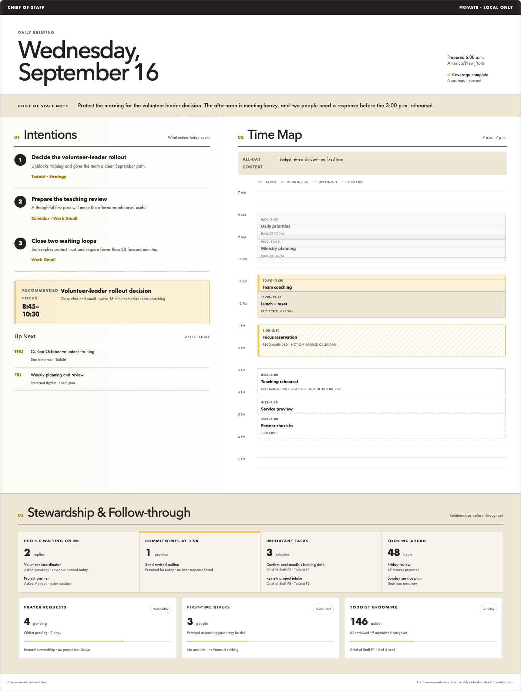
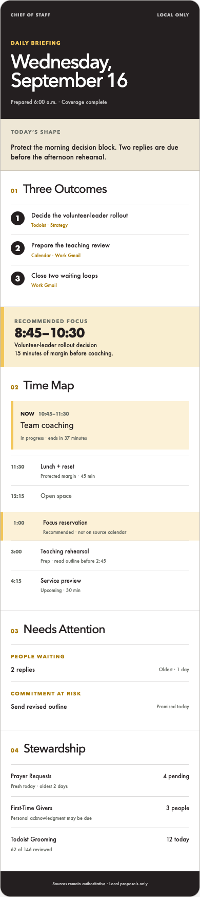
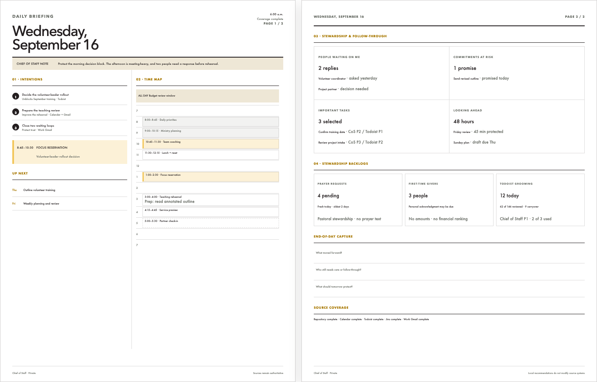
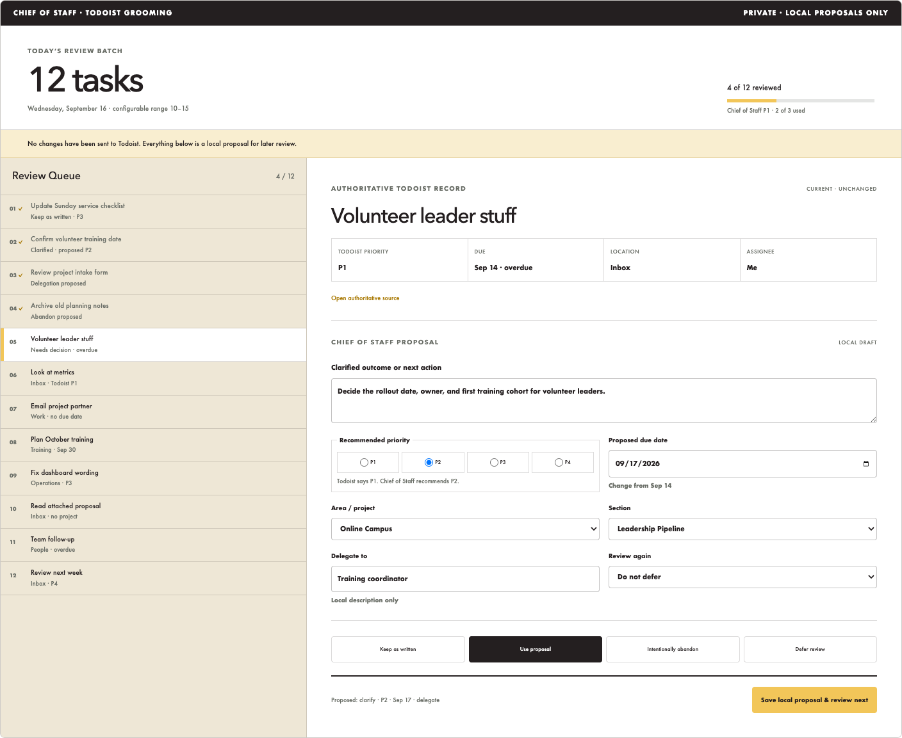
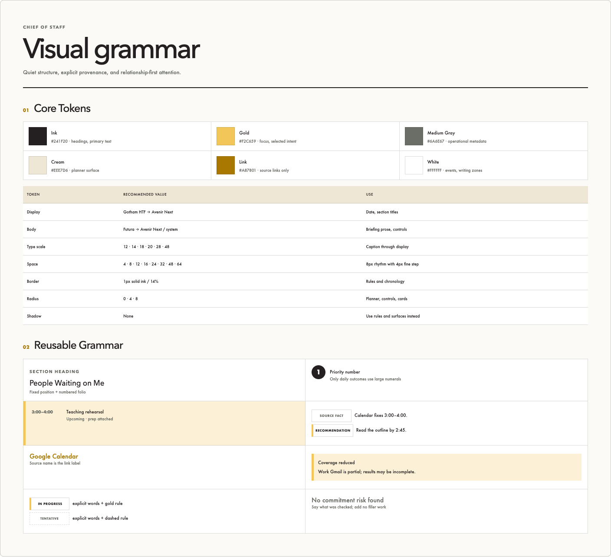

# Daily Briefing Planner Redesign

- **Status:** Proposed
- **Owner:** Brad
- **Last updated:** 2026-08-06
- **Design phase:** High-fidelity concept handoff

## Purpose

This document hands off the reviewed visual direction for a calmer, more
spatial Daily Briefing. It translates the useful rhythm of a premium paper
planner into an original local digital interface while preserving the
accepted Chief of Staff product, privacy, source-authority, and agency
boundaries.

The redesign should help Brad understand within approximately five minutes:

1. the three outcomes that would make today count;
2. fixed Calendar commitments and meaningful open time;
3. preparation required before an event;
4. people waiting for a response;
5. commitments at risk;
6. important work approaching; and
7. the condition of approved stewardship backlogs.

The result should feel like a thoughtful human-prepared daily plan, not an
analytics dashboard, inbox, or project-management board.

## Authority and implementation boundary

The accepted [Daily Briefing v1](../features/daily-briefing-v1.md) remains the
current product contract. This proposed design does not amend that contract,
change the active Milestone 12 trial, authorize a connector or provider call,
or authorize production implementation.

The handoff contains two distinct scopes:

### Core presentation redesign

The planner spread, time map, responsive reading order, print composition,
brand tokens, and presentation grammar may be implemented only after Brad
explicitly accepts this design and authorizes implementation. A core redesign
must use already-approved briefing facts and preserve existing deterministic
selection, ranking, provenance, correction, and coverage behavior.

### Conditional companion capabilities

Prayer Requests, First-Time Givers, Todoist backlog grooming, and local task
proposals are represented so the overall information architecture can be
reviewed. They are not authorized for functional implementation by this
design. Each needs roadmap placement, an accepted feature or requirements
update, exact data contracts, privacy and retention rules, and its own
implementation gate.

In particular, the Todoist grooming view records local proposals only. It must
never imply that a priority, date, title, project, section, assignment, or task
state changed in Todoist.

## Source design inputs

The design is grounded in:

- the current four-page US Letter Daily Briefing rendering reviewed on
  2026-08-05;
- the accepted product, foundation, and architecture documents in this
  repository;
- the Spring 2025 Northridge Church Brand Guidelines; and
- original planner principles: three priorities, a chronological schedule,
  quiet rules, generous margins, and stable recurring locations.

The design does not copy Full Focus Planner branding, wording, artwork, or
proprietary page designs.

All reference images in this handoff use completely synthetic content. They
illustrate the reviewed hierarchy and structure; accepted product behavior and
source-backed data contracts remain authoritative.

## Current-interface assessment

### Retain

- Semantic headings and logical document order.
- Visible keyboard focus and normal source links.
- Explicit source provenance and freshness.
- Written temporal labels such as Earlier Today, In Progress, and Upcoming.
- The local-only boundary and statement that source systems remain
  authoritative.
- The separate correction and disposition detail flow.
- Reduced-coverage disclosure and print break safeguards.

### Simplify

- Shorten the Chief of Staff Note to the day's shape and central tension.
- Reduce repeated role, state, and source badges.
- Replace repeated evidence prose with a concise reason and inspectable source
  link.
- Keep Up Next visibly subordinate to today's three outcomes.

### Move

- Move Calendar records into a spatial time map.
- Place the recommended focus reservation in both Intentions and the Time Map.
- Move generation time and coverage state into quiet masthead metadata.
- Place People Waiting and Commitments at Risk immediately below the planner
  spread.
- Keep detailed coverage at the end of the document or behind a disclosure.

### Remove

- The narrow, single-column desktop reading model.
- Serif typography and the current green accent system.
- Decorative shadows and excessive card chrome.
- Repeated generic “Source record” labels.
- Incidental four-page whitespace caused by linear browser pagination.
- Filler work added only to occupy empty space.

## Navigation model

The page supports three reading speeds:

| Reading time | Brad should understand |
| --- | --- |
| Approximately 5 seconds | Full date, three outcomes, current schedule state, and the next fixed commitment |
| Approximately 30 seconds | Meaningful open time, preparation, people waiting, and commitment risk |
| Approximately 5 minutes | Supporting tasks, approaching work, stewardship backlogs, provenance, uncertainty, and coverage |

Recurring information must keep a stable spatial home so Brad can navigate by
location before reading a heading.

## Desktop structure

The desktop experience is a planner-like two-page spread at approximately
1440 pixels wide.

```text
┌──────────────────────────────────────────────────────────────────────┐
│ Private/local boundary                                               │
├──────────────────────────────────────┬───────────────────────────────┤
│ Daily Briefing + dominant full date  │ Generated time + coverage     │
├──────────────────────────────────────┴───────────────────────────────┤
│ Chief of Staff Note: day shape and central tension                   │
├───────────────────────────────┬──────────────────────────────────────┤
│ 01 Intentions                 │ 02 Time Map                          │
│ Three numbered outcomes       │ All-day context                     │
│ Recommended focus reservation│ 7 a.m.–7 p.m. hourly schedule       │
│ Secondary Up Next             │ Events, open time, prep, and margin │
├───────────────────────────────┴──────────────────────────────────────┤
│ 03 Stewardship & Follow-through                                     │
│ Waiting │ At risk │ Important tasks │ Looking ahead                  │
│ Prayer requests │ First-time givers │ Todoist grooming               │
├──────────────────────────────────────────────────────────────────────┤
│ Sources remain authoritative · local recommendations only            │
└──────────────────────────────────────────────────────────────────────┘
```



### Masthead

- Use “Daily Briefing” as a small uppercase eyebrow.
- Make the full date the dominant H1.
- Show generated time, timezone, coverage state, and source count as quiet
  operational metadata.
- Keep scheduled-trial status out of the primary hierarchy unless it needs
  attention. A normal healthy state can remain in a disclosure or operational
  status view.
- Do not use the Northridge logo without a separate approved asset and explicit
  authorization.

### Chief of Staff Note

- Summarize the shape and central tension of the day in one concise paragraph.
- Prefer one or two sentences.
- Mention schedule density, relationship or commitment risk, protected margin,
  or the day's central tradeoff only when material.
- Do not restate every section or fill the note with source mechanics.

### Intentions

- Display no more than three primary outcomes.
- Use large, persistent numerals 1–3 only for these outcomes.
- Each outcome includes the desired result, why it matters, and a source link.
- Do not elevate a task without sufficient evidence.
- When fewer than three outcomes are supported, leave the remaining space
  quiet rather than adding low-priority work.
- Place Up Next after the outcomes with smaller type and less contrast.

### Recommended focus reservation

- Present the time as a deliberate reservation, not another task.
- Pair the reservation with a supported objective when one exists.
- State when a block is recommended and not present on the authoritative
  Calendar.
- Preserve transition margin and the protected lunch rule.
- Represent the reservation in both the Intentions page and Time Map so the
  recommendation is connected to purpose and time.

### Time Map

- Render a vertical hourly schedule from approximately 7 a.m. through 7 p.m.
  and expand earlier or later when fixed events require it.
- Position events against recognizable time slots using exact start and end
  times.
- Make open time spatially legible without implying that every free minute
  should be filled.
- Display All-Day Context above the hourly grid.
- Place preparation immediately beside or beneath the event that requires it.
- Keep lunch and transition margin visibly distinct from ordinary free time.

Status treatments must combine words with form:

| Status | Visual treatment | Required label |
| --- | --- | --- |
| Earlier today | Muted gray surface and text | Earlier today |
| In progress | Gold left rule and light gold surface | In progress |
| Upcoming | White surface and neutral rule | Upcoming |
| Tentative | Dashed border | Tentative |
| All-day context | Cream context row outside hourly grid | All-day context |
| Recommended focus | Gold rule with subtle diagonal or light fill | Recommended · not on source calendar, when applicable |

### Stewardship and follow-through

Use a stable four-column summary beneath the planner spread:

1. People Waiting on Me;
2. Commitments at Risk;
3. Important Tasks; and
4. Looking Ahead.

Relationship and commitment risk receive visual precedence over ordinary task
volume. Counts provide orientation, but the section must not become a KPI
dashboard.

## Stewardship backlog concepts

The backlog cards share one compact grammar: name, current count, freshness,
oldest or unresolved age, a restrained progress rule when meaningful, and one
plain-language stewardship implication.

### Prayer Requests

- Source concept: Work Gmail label `0 Urgent/prayer`.
- Show pending count, freshness, and oldest pending age.
- Never display prayer text or sensitive pastoral details in the overview.
- Avoid performance language; this is pastoral stewardship.

### First-Time Givers

- Show how many people appear to need a timely personal acknowledgment.
- Never display giving amounts.
- Never rank or compare people by financial value.
- Avoid implying that a deterministic signal replaces pastoral or relational
  judgment.

### Todoist Grooming

- Show total active backlog, first-pass progress, unresolved carryover, and
  today's review batch.
- Default to 12 new tasks per eligible day within a configurable range of
  10–15.
- Keep Todoist priority and Chief of Staff recommended priority visibly
  separate.
- Allow at most three Chief of Staff P1 recommendations. A fourth requires an
  explicit tradeoff.

These backlog concepts remain conditional until separately accepted.

## Mobile adaptation

At approximately 390 pixels, use one deliberate reading sequence:

1. private/local boundary, date, generated time, and coverage;
2. concise day-shape note;
3. three outcomes;
4. recommended focus reservation;
5. current and chronological Time Map;
6. People Waiting and Commitments at Risk;
7. stewardship backlogs; and
8. source-authority footer.

Do not hide essential information behind hover. The mobile Time Map may use a
chronological list rather than a scaled hourly canvas, but it must preserve
every fixed event, exact times, temporal labels, preparation, and meaningful
open-time context.



## US Letter print adaptation

The representative complete-day fixture should compose cleanly into two US
Letter pages:

- Page 1: masthead, Chief of Staff Note, Intentions, focus reservation, and Time
  Map.
- Page 2: follow-through, stewardship backlogs, optional end-of-day capture,
  and source coverage.



Real content may require additional pages. Printing must never clip, overlap,
or silently omit content to preserve a two-page target.

Print requirements:

- Use `@page { size: Letter; }` with intentional margins.
- Remove browser-only navigation and interactive controls.
- Avoid browser-added URLs, unnecessary headers, and accidental blank pages.
- Prevent individual outcomes, events, and compact cards from breaking when
  practical.
- Preserve written status labels when color is unavailable.
- Keep source links human-readable when printed.

## Todoist grooming companion view

The grooming view is a separate local workflow, not a dense extension of the
daily planner.



### Layout

- Left rail: today's 12-task queue, review progress, and concise decision state.
- Right panel: authoritative Todoist record followed by a visibly separate
  Chief of Staff proposal.
- Persistent boundary message: no changes have been sent to Todoist.

### Authoritative record

Display the unchanged Todoist title, priority, due date, project or section,
and assignment with a link to the source record.

### Local proposal

Allow Brad to record locally:

- keep as written;
- clarify the outcome or next action;
- recommend P1, P2, P3, or P4;
- add, change, or remove a due date;
- choose an area, project, or section;
- delegate;
- intentionally abandon; or
- defer review.

The primary action must say “Save local proposal” rather than “Update
Todoist.” Any later source-system write would require a separate product,
agency, authorization, security, and audit decision.

## Brand and design tokens

Use the Northridge identity lightly. This is an internal leadership tool, not
a promotional church webpage.



### Color

| Token | Value | Primary use |
| --- | --- | --- |
| `color-ink` | `#241F20` | Primary text, headings, structural rules |
| `color-gold` | `#F2C659` | Focus, selection, in-progress state, restrained attention |
| `color-gray` | `#6A6E67` | Operational metadata and secondary text |
| `color-cream` | `#EEE7D6` | Planner surface and quiet context |
| `color-link` | `#A87801` | Source links only |
| `color-white` | `#FFFFFF` | Event blocks, writing areas, and neutral surfaces |

Gold must not become a universal highlight. Do not rely on it without a
written label, border style, or spatial treatment.

### Typography

| Role | Preferred | Local fallback | Approximate size |
| --- | --- | --- | --- |
| Display / H1 | Gotham HTF Bold | Avenir Next Heavy, then system sans | 48px desktop |
| H2 | Gotham HTF Bold | Avenir Next Demi Bold, then system sans | 28px |
| H3 | Gotham HTF Medium | Avenir Next Medium, then system sans | 20px |
| Intro | Futura Medium | Avenir Next Medium, then system sans | 18px |
| Body | Futura Book | Avenir Next Regular, then system sans | 14px |
| Caption | Futura Book | Avenir Next Regular, then system sans | 12px |

Do not fetch, embed, or depend on an external font. Licensed fonts may be used
only when available locally and approved for this application.

### Geometry

| Token group | Values | Guidance |
| --- | --- | --- |
| Spacing | 4, 8, 12, 16, 24, 32, 48, 64px | Use an 8px rhythm with a 4px fine step |
| Borders | 1px solid ink at approximately 14% opacity | Use rules to create planner structure |
| Radii | 0, 4, 8px | Square planner regions; modest control and card rounding |
| Shadows | None | Use spacing, rules, and surfaces instead |
| Maximum desktop content | Approximately 1360px inside 1440px viewport | Preserve generous outer margins |

## Reusable component grammar

### Section headings

- Pair a two-digit folio with the section name.
- Use one strong horizontal rule beneath major sections.
- Keep section summaries subordinate and right-aligned on desktop when space
  permits.

### Facts, recommendations, and uncertainty

- Source fact: neutral white surface, concise fact, and source link.
- Recommendation: gold left rule or light gold surface plus the word
  “Recommended.”
- Uncertainty or incomplete coverage: explicit written limitation with a gold
  rule; never imply confidence through omission.
- Conflicting source facts: preserve both source attributions and explain the
  conflict instead of silently reconciling it.

### Links

- Use the source-system name as the link label.
- Reserve the link color for links rather than decorative text.
- Keep source links in the same location within each repeated component.

### Empty states

- Say what was checked and that no material item was found.
- Omit a section when the accepted specification permits omission.
- Do not invent tasks, risks, outcomes, or metrics to fill space.

### Backlog cards

- Use one shared information order across all cards.
- Pair counts with freshness or age so volume is not shown without context.
- Avoid charts, trend arrows, hidden scores, or gamified health labels.

## Accessibility requirements

- Maintain strong contrast for text against its actual surface.
- Use semantic headings and a logical reading order independent of visual
  columns.
- Preserve visible keyboard focus.
- Do not hide meaning in hover states.
- Pair color with text, border style, or position.
- Use written temporal and recommendation labels.
- Keep touch targets comfortable at mobile width.
- Ensure all forms have visible labels and server-side validation.
- Respect reduced-motion preferences if progressive enhancement is added.

## Security and privacy requirements

- Remain loopback-only under
  [ADR-0008](../../decisions/0008-adopt-flask-local-web-interface.md).
- Use server-rendered Jinja templates and local CSS.
- Add no external scripts, stylesheets, fonts, images, telemetry, analytics,
  remote assets, service workers, or browser storage containing private data.
- Preserve Jinja escaping, source-URL validation, no-store responses, CSRF,
  request limits, trusted Host and Origin behavior, and local-only forms.
- Use only synthetic data in fixtures, screenshots, and committed examples.
- Do not expose prayer text, giving amounts, private email content, donor
  details, or unnecessary personal data in overview surfaces.

## Component-level implementation handoff

### `src/chief_of_staff/web/templates/base.html`

- Retain the private/local boundary and source-authority footer.
- Update the presentation tokens and page width without adding remote assets.
- Preserve the main landmark and current accessibility behavior.

### `src/chief_of_staff/web/templates/home.html`

- Replace the single generic visual treatment with planner-specific Jinja
  macros or partials for the masthead, outcomes, focus reservation, Time Map,
  follow-through, backlog cards, and coverage.
- Preserve a safe generic fallback for an unknown or newly introduced section.
- Keep source links, uncertainty, explanation, local state, and correction
  links available without making all metadata equally prominent.

### `src/chief_of_staff/web/templates/conclusion.html`

- Keep correction, disposition, evidence, history, deletion, CSRF, version,
  and idempotency behavior separate from the daily planner.
- Restyle it with the same tokens only after the primary briefing hierarchy is
  accepted.

### `src/chief_of_staff/web/static/style.css`

- Replace the current serif and green system with the local Northridge token
  layer.
- Add the desktop spread, hourly grid, compact follow-through grid, mobile
  sequence, and US Letter print regions.
- Use no framework, preprocessors, build tooling, or remote dependencies.
- Keep existing focus behavior and strengthen it where controls move onto gold
  or cream surfaces.

### `src/chief_of_staff/web/presentation.py` and `web/app.py`

- Preserve the application-owned briefing plan and deterministic ordering.
- Reuse existing `starts_at`, `ends_at`, and `temporal_state` facts.
- Calculate timeline geometry only from trusted normalized times. Templates
  must not parse untrusted source text to infer schedule positions.
- Add presentation fields only when the accepted data contract supports them.
- Do not create backlog metrics or grooming proposals in the template.

### Tests

- Update semantic and content contract tests without replacing them with
  screenshot-only assertions.
- Add synthetic representative fixtures for dense, sparse, non-workday,
  partial-source, all-day, tentative, overlapping, and extended-hours days.
- Verify exact status labels, source links, local-only language, preparation
  adjacency, no unsupported outcomes, and no external assets.
- Add responsive browser review at approximately 1440 and 390 pixels.
- Render the representative print fixture and inspect every page.

## Suggested Codex implementation sequence

This sequence begins only after explicit implementation authorization.

1. Re-read `AGENTS.md`, the accepted Daily Briefing feature specification,
   ADR-0008, this handoff, and the current templates and tests.
2. Capture the current synthetic before-state at desktop, mobile, and print
   widths.
3. Implement the brand token layer and page-width foundation without changing
   behavior.
4. Introduce planner-specific semantic markup and a generic fallback.
5. Implement the Time Map using trusted presentation times.
6. Add the follow-through grid using existing accepted sections only.
7. Implement responsive and print composition.
8. Preserve and restyle the conclusion-detail flow.
9. Run the full repository gate with `make check`.
10. Perform visual review with only synthetic fixtures and present the result
    to Brad for acceptance.

Do not implement conditional stewardship backlogs or Todoist grooming inside
this sequence unless their separate product gates have been accepted.

## Acceptance criteria for the core redesign

The core presentation may be proposed for acceptance when:

- Brad can find the top outcomes and current schedule state within five
  seconds at approximately 1440 pixels.
- The desktop page reads as a stable Intentions and Time Map spread.
- Every fixed Calendar event retains its exact displayed start and end time.
- Earlier, in-progress, upcoming, tentative, and all-day states are written and
  visually distinct.
- Preparation remains adjacent to the event it supports.
- Meaningful open time, lunch, and transition margin are understandable without
  implying that all capacity should be filled.
- People Waiting and Commitments at Risk are findable within 30 seconds.
- Recommendations remain visibly distinct from source facts.
- Source links and coverage limitations remain inspectable.
- Sparse days stay quiet and contain no filler work.
- The 390-pixel presentation preserves complete essential meaning without
  overlap or horizontal scrolling.
- The representative US Letter fixture renders without clipping, overlap,
  broken components, or accidental blank pages.
- The interface uses no logo, remote asset, external font, analytics,
  telemetry, or external write.
- Existing correction, history, privacy, source-authority, and security tests
  continue to pass.
- `make check` passes.
- Brad reviews the actual local interface and print rendering before the
  design status changes to Accepted.

## Decisions still required

Before core implementation:

1. Brad must explicitly accept this visual direction.
2. Brad must explicitly authorize a presentation-layer implementation task.
3. The implementation task must state whether the current active scheduled
   trial may receive presentation-only changes or whether implementation waits
   until after the Milestone 12 post-trial review.

Before companion-capability implementation:

1. Place Prayer Requests, First-Time Givers, and Todoist grooming in the
   roadmap.
2. Define exact sources, normalization, retention, sensitivity, coverage, and
   correction behavior.
3. Define the local proposal lifecycle and whether any later Todoist write path
   will exist.
4. Accept separate synthetic, privacy, agency, and human-review gates.
